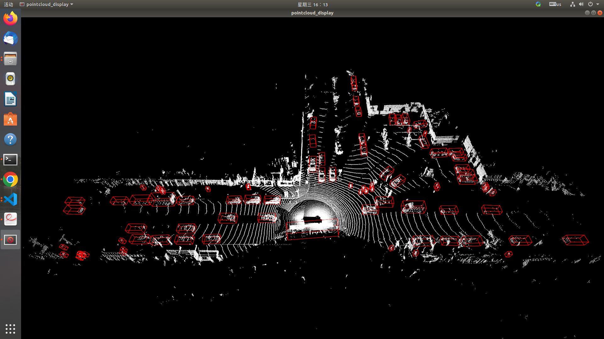

# CenterPointTensorRTDisplay
Display Detection Results of CenterPointTensorRT: https://github.com/HaohaoNJU/CenterPoint

<p align="center">  </p>

## lidar point cloud data
lidars/seq_0_frame_100.bin is from https://github.com/HaohaoNJU/CenterPoint/tree/master/lidars

## detection results
results/seq_0_frame_100.bin.txt is generated by the command from https://github.com/HaohaoNJU/CenterPoint  
command is:
```
./build/centerpoint \
--pfeOnnxPath=models/pfe_baseline32000.onnx \
--rpnOnnxPath=models/rpn_baseline.onnx \
--savePath=results \
--filePath=/PATH/TO/DATA \
--fp16
```

#how to see the results
```
python display.py
```